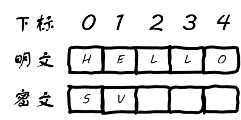

# 埃特巴什码加密(Atbash Cipher)

# 一、安装

```bash
go get -u github.com/cryptography-research-lab/go-atbash-cipher
```

# 二、代码示例

## 2.1 加密 & 解密 

```go
package main

import (
	"fmt"
	atbash_cipher "github.com/cryptography-research-lab/go-atbash-cipher"
)

func main() {

	// 对明文进行加密
	encrypt := atbash_cipher.Encrypt("HELLO")
	fmt.Println(encrypt) // Output: SVOOL

	// 对加密结果进行解密
	decrypt := atbash_cipher.Decrypt(encrypt)
	fmt.Println(decrypt) // Output: HELLO

}
```

## 2.2 破解 

TODO 

# 三、埃特巴什码加密(Atbash Cipher)原理详解

## 3.1 加密原理及过程详解

`Atbash Cipher`是属于古典密码中的一种替换型加密，它有一张映射用的密码表，只不过这张映射的密码表比较特殊，映射关系如下：


可以看到上边这一行正好是`A-Z`的字典序排列，而下边这一·行正好是`A-Z`的字典序逆序排序，因此解密就是再进行一次加密，而从M和N之间那里算，它是对称的：


下面让我们以要加密的明文`HELLO`为例来详细描述每一步的加密过程，因为是一对一进行的替换，因此加密后的密文的长度是和明文相等的，所以现在情况是这样子：


明文下标0的字母是H，而H在映射表中对应的是S，因此密文的第一个字母是S：


明文下标1的字母是E，而E在映射表中对应的是V，因此密文的第二个字母是V：



明文下标2的字母是L，而L在映射表中对应的是O，因此密文的第三个字母是O：


明文下标3的字母是L，而L在映射表中对应的是O，因此密文的第四个字母是O：


明文下标4的字母是O，而O在映射表中对应的是L，因此密文的第四个字母是L：


最终得到的加密结果是`SVOOL`：


解密和加密相同，不再赘述。

## 3.2 对Atbash Cipher的扩展

扩展尝试：能够对密码表进行扩展，不一定非要使用默认的密码表，同时又能够保持解密是再加密一次的特性。

TODO 已经论证是可行的，待编码实现 

# 四、埃特巴什码加密(Atbash Cipher)破解原理详解

TODO 


